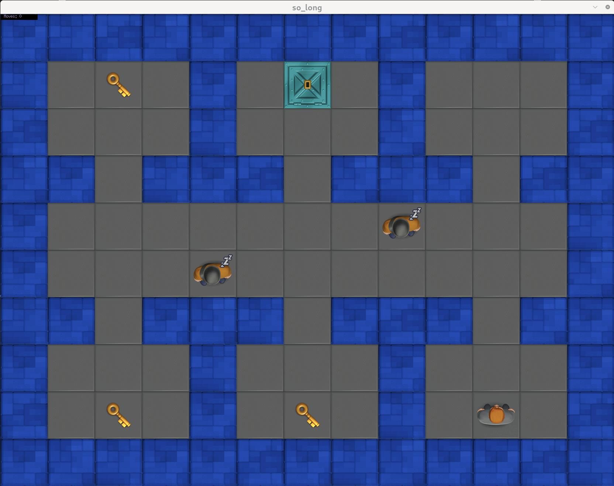
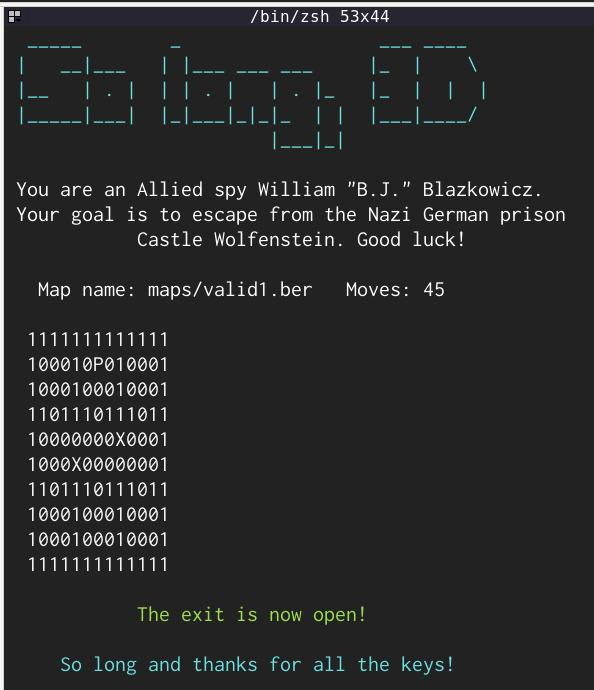

# so_long

A small game project inspired by Wolfenstein 3D. Made at Hive Helsinki with the use of very feature limited Minilibx to render things in a window. For Linux.

Graphics were made in Blender and Photoshop. Yes, you may use them in your own so_long project if you want!

Terminal/console view

